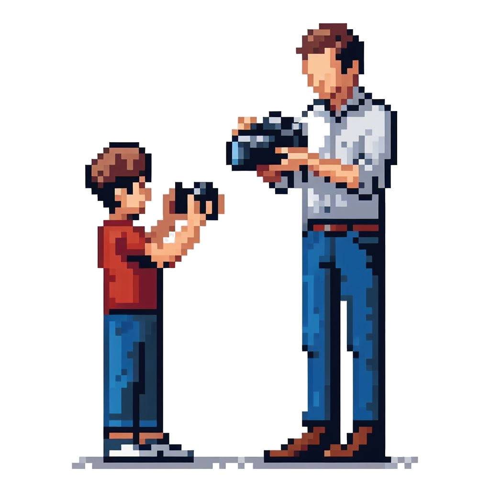

<!-- PROJECT SHIELDS -->
[![Contributors][contributors-shield]][contributors-url]
[![Forks][forks-shield]][forks-url]
[![Stargazers][stars-shield]][stars-url]
[![Issues][issues-shield]][issues-url]
[![MIT License][license-shield]][license-url]
[![LinkedIn][linkedin-shield]][linkedin-url]

<!-- PROJECT LOGO -->
 

  

  <h3 align="center">WildLife</h3>

  

    AI narrating your life like in the movies!
     
    <a href="https://github.com/philt-one/wildlife/"><strong>Explore the docs »</strong></a>
     
         ·
    <a href="https://github.com/philt-one/wildlife/issues">Report Bug</a>
    ·
    <a href="https://github.com/philt-one/wildlife/issues">Request Feature</a>
  

<!-- TABLE OF CONTENTS -->

  
Table of Contents

  <ol>
    <li>
      <a href="#about-the-project">About The Project</a>
      <ul>
        <li><a href="#built-with">Built With</a></li>
      </ul>
    </li>
    <li><a href="#roadmap">Roadmap</a></li>
    <li><a href="#contributing">Contributing</a></li>
    <li><a href="#license">License</a></li>
    <li><a href="#contact">Contact</a></li>
    <li><a href="#acknowledgments">Acknowledgments</a></li>
  </ol>

<!-- ABOUT THE PROJECT -->
## About The Project

[![Product Name Screen Shot][product-screenshot]](https://example.com)

### Built With

* [![React-Native][React-Native]][React-Native-url]

(<a href="#readme-top">back to top</a>)

  

<!-- ROADMAP -->
## Roadmap

- [ ] Add mobile client

See the [open issues](https://github.com/philt-one/wildlife/issues) for a full list of proposed features (and known issues).

(<a href="#readme-top">back to top</a>)

<!-- CONTRIBUTING -->
## Contributing

Contributions are what make the open source community such an amazing place to learn, inspire, and create. Any contributions you make are **greatly appreciated**.

If you have a suggestion that would make this better, please fork the repo and create a pull request. You can also simply open an issue with the tag "enhancement".
Don't forget to give the project a star! Thanks again!

1. Fork the Project
2. Create your Feature Branch (`git checkout -b feature/AmazingFeature`)
3. Commit your Changes (`git commit -m 'Add some AmazingFeature'`)
4. Push to the Branch (`git push origin feature/AmazingFeature`)
5. Open a Pull Request

(<a href="#readme-top">back to top</a>)

<!-- LICENSE -->
## License

Distributed under the Apache 2.0 License. See `LICENSE` for more information.

(<a href="#readme-top">back to top</a>)

<!-- CONTACT -->
## Contact

Philippe Talarico - [Linkedin](https://www.linkedin.com/in/philippe-talarico/)

Project Link: [https://github.com/philt-one/wildlife/](https://github.com/philt-one/wildlife/)

(<a href="#readme-top">back to top</a>)

<!-- MARKDOWN LINKS & IMAGES -->
<!-- https://www.markdownguide.org/basic-syntax/#reference-style-links -->
[contributors-shield]: https://img.shields.io/github/contributors/philt-one/wildlife.svg
[contributors-url]: https://github.com/philt-one/wildlife/graphs/contributors
[forks-shield]: https://img.shields.io/github/forks/philt-one/wildlife.svg
[forks-url]: https://github.com/philt-one/wildlife/network/members
[stars-shield]: https://img.shields.io/github/stars/philt-one/wildlife.svg
[stars-url]: https://github.com/philt-one/wildlife/stargazers
[issues-shield]: https://img.shields.io/github/issues/philt-one/wildlife.svg
[issues-url]: https://github.com/philt-one/wildlife/issues
[license-shield]: https://img.shields.io/github/license/philt-one/wildlife.svg
[license-url]: https://github.com/philt-one/wildlife/blob/master/LICENSE.txt
[linkedin-shield]: https://img.shields.io/badge/-LinkedIn-black.svg?logo=linkedin&colorB=555
[linkedin-url]: https://linkedin.com/in/othneildrew
[product-screenshot]: ./images/screenshot.png
[Next.js]: https://img.shields.io/badge/next.js-000000?logo=nextdotjs&logoColor=white
[Next-url]: https://nextjs.org/
[React.js]: https://img.shields.io/badge/React-20232A?logo=react&logoColor=61DAFB
[React-url]: https://reactjs.org/
[Vue.js]: https://img.shields.io/badge/Vue.js-35495E?logo=vuedotjs&logoColor=4FC08D
[Vue-url]: https://vuejs.org/
[Angular.io]: https://img.shields.io/badge/Angular-DD0031?logo=angular&logoColor=white
[Angular-url]: https://angular.io/
[Svelte.dev]: https://img.shields.io/badge/Svelte-4A4A55?logo=svelte&logoColor=FF3E00
[Svelte-url]: https://svelte.dev/
[Laravel.com]: https://img.shields.io/badge/Laravel-FF2D20?logo=laravel&logoColor=white
[Laravel-url]: https://laravel.com
[Bootstrap.com]: https://img.shields.io/badge/Bootstrap-563D7C?logo=bootstrap&logoColor=white
[Bootstrap-url]: https://getbootstrap.com
[JQuery.com]: https://img.shields.io/badge/jQuery-0769AD?logo=jquery&logoColor=white
[JQuery-url]: https://jquery.com 

[React-Native]: https://img.shields.io/badge/React-Native-20232A?logo=react&logoColor=61DAFB
[React-Native-url]: https://reactnative.dev/
